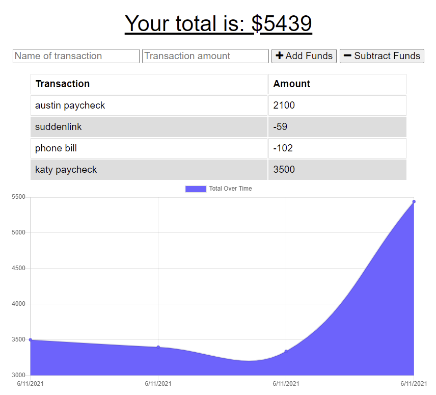

# Budget Tracker 

## Table of Contents

- [Description](#description)
- [Technology Used](#technology)
- [Resources](#resources)
- [Licensing Information](#licensing)
- [Screenshots](#screenshots)
- [GIF Demonstration](#demonstrations)
   
   

## Description

This is a project using Node.js, Express.js, MongoDB, Mongoose ODM, and IndexedDB to build a Progressive Web App online/offline budget tracker. When the user first visits the budget tracker, they will see a page that has an empty line graph, an empty transaction chart, and two fields the user can enter the name of the transaction, and enter the monetary amount. Once the name and amount has been entered, the user will click _+Add Funds_ if the amount is a deposit, or _-Subtract Funds_ if the amount is an expenditure.

Once the transaction is entered, the name and amount are displayed in the table as well as on the line graph. If the user is offline, they will be able to see any transactions entered prior to going offline, as well as be able to enter transactions while offline. Once the user is back online, the transactions will be added permanently to the database.

### Please follow [this link](https://enigmatic-citadel-00070.herokuapp.com/) to view the live application.

 

## Technology

- JavaScript
- Node.js
- Express.js
- MongoDB
- Mongoose ODM
- IndexedDB
- Webmanifest
- Progressive Web App

 
 

## Resources

- [IndexedDB Documentation](https://developer.mozilla.org/en-US/docs/Web/API/IndexedDB_API)
- [Web App Manifests](https://developer.mozilla.org/en-US/docs/Web/Manifest)
- [Live Data in the Service Worker](https://developers.google.com/web/ilt/pwa/live-data-in-the-service-worker)
- [Apple Touch Icon](https://web.dev/apple-touch-icon/?utm_source=lighthouse&utm_medium=devtools)
   
   

## Licensing Information

This project is covered under the MIT license.

## Screenshots

## Demonstrations

 
